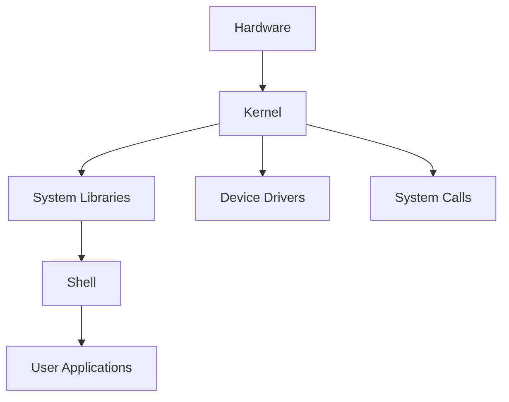

# 리눅스 OS 완전 정복 강의안

## 강의 개요
본 강의는 리눅스 운영체제의 기초부터 고급 활용까지 체계적으로 학습하는 과정입니다. 8개 섹터로 구성되어 있으며, 각 섹터마다 실습 연습 문제를 통해 실무 능력을 향상시킬 수 있습니다.

---

## 섹터 1: 리눅스 기초와 환경 설정

### 1.1 리눅스란 무엇인가?
- **리눅스의 정의와 특징**
  - 오픈 소스 운영체제
  - 다중 사용자, 다중 태스킹 지원
  - 안정성과 보안성

- **리눅스 배포판 종류**
  - Ubuntu, CentOS, Debian, Fedora
  - 각 배포판의 특징과 용도

### 1.2 리눅스 환경 준비
- **가상머신 설치**
  - VirtualBox 또는 VMware 사용
  - 리눅스 배포판 설치 과정

- **로그인, 로그아웃, 종료**
  ```bash
  # 로그인
  username: [사용자명]
  password: [비밀번호]
  
  # 로그아웃
  exit
  logout
  
  # 시스템 종료
  shutdown -h now
  poweroff
  ```

### 1.3 기본 시스템 구조


### 📋 **섹터 1 실습 연습 문제**

**문제 1-1: 환경 설정**
1. 가상머신에 Ubuntu 또는 CentOS 설치
2. 사용자 계정 생성하기
3. 시스템 정보 확인하기 (`uname -a`, `cat /etc/os-release`)

**문제 1-2: 기본 명령어**
1. 현재 사용자 확인: `whoami`
2. 현재 시간 확인: `date`
3. 시스템 가동 시간 확인: `uptime`
4. 로그인 사용자 목록 확인: `who`

**문제 1-3: 시스템 종료**
1. 1분 후 시스템 종료 예약하기
2. 예약된 종료 취소하기
3. 즉시 재부팅하기

---

## 섹터 2: 셸과 명령어 기초

### 2.1 셸(Shell)이란?
- **셸의 역할과 기능**
  - 사용자와 커널 간의 인터페이스
  - 명령어 해석기
  - 스크립팅 환경 제공

### 2.2 셸의 종류
- **주요 셸 종류**
  - bash (Bourne Again Shell)
  - zsh (Z Shell)
  - fish (Friendly Interactive Shell)
  - csh (C Shell)

### 2.3 프롬프트와 터미널
- **프롬프트 구성 요소**
  ```bash
  [user@hostname current_directory]$
  ```
- **터미널 환경**
  - 물리적 터미널 vs 가상 터미널
  - 터미널 에뮬레이터

### 2.4 명령어 기본 구조
```mermaid
graph LR
    A[Command] --> B[Options]
    B --> C[Arguments]
    
    D[ls] --> E[-l -a]
    E --> F[/home/user]
```

### 2.5 명령어 편집 기능
- **커맨드 라인 편집**
  - Ctrl+A: 행의 시작으로 이동
  - Ctrl+E: 행의 끝으로 이동
  - Ctrl+U: 커서 앞 내용 삭제
  - Ctrl+K: 커서 뒤 내용 삭제

- **자동 완성과 명령 이력**
  - Tab 키를 이용한 자동 완성
  - 위/아래 화살표로 명령 이력 탐색
  - `history` 명령어 활용

### 📋 **섹터 2 실습 연습 문제**

**문제 2-1: 셸 환경 탐색**
1. 현재 사용 중인 셸 확인: `echo $SHELL`
2. 사용 가능한 셸 목록 확인: `cat /etc/shells`
3. 셸 변경해보기: `chsh`

**문제 2-2: 명령어 이력 활용**
1. 최근 실행한 명령어 10개 확인
2. 특정 명령어 검색: `history | grep ls`
3. 이력 번호로 명령어 재실행: `!번호`

**문제 2-3: 자동 완성 연습**
1. `/usr/bin/` 디렉터리의 파일들을 Tab으로 완성
2. 명령어 옵션 자동 완성 연습
3. 파일명 자동 완성 연습

---

## 섹터 3: 파일 시스템과 디렉터리 구조

### 3.1 리눅스 파일 시스템 구조
- **계층적 디렉터리 구조**
  ```mermaid
  graph TD
      A[/] --> B[/bin]
      A --> C[/etc]
      A --> D[/home]
      A --> E[/usr]
      A --> F[/var]
      A --> G[/tmp]
      A --> H[/dev]
      A --> I[/proc]
      D --> J[/home/user1]
      D --> K[/home/user2]
  ```

### 3.2 주요 디렉터리 설명
- **시스템 디렉터리**
  - `/bin`: 기본 명령어
  - `/etc`: 설정 파일
  - `/home`: 사용자 홈 디렉터리
  - `/usr`: 사용자 프로그램
  - `/var`: 가변 데이터
  - `/tmp`: 임시 파일

### 3.3 경로 개념
- **절대 경로 vs 상대 경로**
  ```bash
  # 절대 경로
  /home/user/documents/file.txt
  
  # 상대 경로
  ./documents/file.txt
  ../user/documents/file.txt
  ```

### 3.4 디렉터리 이동과 탐색
- **기본 탐색 명령어**
  ```bash
  pwd                 # 현재 위치 확인
  cd /home/user      # 절대 경로로 이동
  cd documents       # 상대 경로로 이동
  cd ..              # 상위 디렉터리로 이동
  cd ~               # 홈 디렉터리로 이동
  cd -               # 이전 디렉터리로 이동
  ```

### 3.5 파일 목록 확인
- **ls 명령어 활용**
  ```bash
  ls                 # 기본 목록
  ls -l              # 상세 정보
  ls -a              # 숨김 파일 포함
  ls -la             # 상세 정보 + 숨김 파일
  ls -lh             # 파일 크기를 읽기 쉽게
  ls -R              # 하위 디렉터리까지 재귀적 표시
  ```

### 📋 **섹터 3 실습 연습 문제**

**문제 3-1: 디렉터리 구조 탐색**
1. 루트 디렉터리의 하위 디렉터리들 확인
2. `/etc` 디렉터리의 내용 확인
3. 본인 홈 디렉터리의 절대 경로 확인

**문제 3-2: 경로 이동 연습**
1. 홈 디렉터리에서 `/tmp`로 이동
2. 상대 경로로 `/var/log`로 이동
3. 이전 디렉터리로 돌아가기

**문제 3-3: 파일 목록 분석**
1. 홈 디렉터리의 모든 파일(숨김 파일 포함) 상세 정보 출력
2. 파일 크기 순으로 정렬하여 표시
3. 최근 수정된 파일 순으로 정렬

---

## 섹터 4: 파일과 디렉터리 조작

### 4.1 파일과 디렉터리 생성
- **디렉터리 생성**
  ```bash
  mkdir directory_name           # 디렉터리 생성
  mkdir -p parent/child/grandchild  # 중간 디렉터리까지 생성
  mkdir dir1 dir2 dir3          # 여러 디렉터리 동시 생성
  ```

- **파일 생성**
  ```bash
  touch filename.txt            # 빈 파일 생성
  touch file1.txt file2.txt     # 여러 파일 동시 생성
  touch /path/to/file.txt       # 특정 경로에 파일 생성
  ```

### 4.2 파일 내용 확인
- **파일 내용 출력**
  ```bash
  cat filename.txt              # 전체 내용 출력
  less filename.txt             # 페이지 단위로 보기
  head filename.txt             # 처음 10줄 출력
  tail filename.txt             # 마지막 10줄 출력
  head -n 5 filename.txt        # 처음 5줄 출력
  tail -f filename.txt          # 실시간 모니터링
  ```

### 4.3 파일과 디렉터리 복사
- **복사 명령어**
  ```bash
  cp source.txt destination.txt    # 파일 복사
  cp -r source_dir dest_dir       # 디렉터리 복사
  cp *.txt backup/                # 패턴 매칭으로 복사
  cp -i source.txt dest.txt       # 덮어쓰기 확인
  ```

### 4.4 파일과 디렉터리 이동/이름 변경
- **이동 명령어**
  ```bash
  mv oldname.txt newname.txt      # 파일 이름 변경
  mv file.txt /path/to/directory/ # 파일 이동
  mv directory1 directory2       # 디렉터리 이름 변경
  ```

### 4.5 파일과 디렉터리 삭제
- **삭제 명령어**
  ```bash
  rm filename.txt                 # 파일 삭제
  rm -i filename.txt              # 삭제 확인
  rm -r directory_name            # 디렉터리 삭제
  rm -rf directory_name           # 강제 삭제
  rmdir empty_directory           # 빈 디렉터리 삭제
  ```

### 4.6 링크 생성
- **하드 링크와 심볼릭 링크**
  ```bash
  ln original.txt hardlink.txt        # 하드 링크
  ln -s /path/to/original.txt symlink.txt  # 심볼릭 링크
  ```

### 📋 **섹터 4 실습 연습 문제**

**문제 4-1: 파일 및 디렉터리 생성**
1. 홈 디렉터리에 `linux_practice` 디렉터리 생성
2. 그 안에 `documents`, `scripts`, `backup` 하위 디렉터리 생성
3. 각 디렉터리에 테스트 파일 생성

**문제 4-2: 파일 내용 다루기**
1. 여러 줄의 텍스트가 포함된 파일 생성
2. 다양한 명령어로 파일 내용 확인
3. 파일의 처음 5줄과 마지막 5줄만 출력

**문제 4-3: 파일 조작 연습**
1. 파일 복사, 이동, 이름 변경 연습
2. 와일드카드를 사용한 여러 파일 조작
3. 백업 디렉터리 생성 및 파일 백업

**문제 4-4: 안전한 파일 삭제**
1. 테스트 파일들을 안전하게 삭제
2. 확인 옵션을 사용한 삭제 연습
3. 디렉터리 전체 삭제 연습

---

## 섹터 5: 텍스트 처리와 에디터

### 5.1 텍스트 에디터 소개
- **텍스트 파일 vs 바이너리 파일**
  - 텍스트 파일: 사람이 읽을 수 있는 형태
  - 바이너리 파일: 컴퓨터가 처리하는 형태

### 5.2 Vim 에디터 기초
- **Vim 모드**
  ```mermaid
  graph LR
      A[Normal Mode] --> B[Insert Mode]
      B --> A
      A --> C[Command Mode]
      C --> A
      A --> D[Visual Mode]
      D --> A
  ```

- **기본 Vim 명령어**
  ```bash
  vim filename.txt              # 파일 열기
  
  # Insert Mode 진입
  i                            # 커서 위치에서 입력
  a                            # 커서 다음 위치에서 입력
  o                            # 새 줄에서 입력
  
  # 저장 및 종료
  :w                           # 저장
  :q                           # 종료
  :wq                          # 저장 후 종료
  :q!                          # 강제 종료
  ```

### 5.3 효율적인 Vim 사용법
- **커서 이동**
  ```bash
  h, j, k, l                   # 좌, 하, 상, 우
  w                            # 다음 단어로
  b                            # 이전 단어로
  gg                           # 파일 시작으로
  G                            # 파일 끝으로
  :n                           # n번째 줄로
  ```

- **편집 명령어**
  ```bash
  x                            # 문자 삭제
  dd                           # 줄 삭제
  yy                           # 줄 복사
  p                            # 붙여넣기
  u                            # 실행 취소
  Ctrl+r                       # 재실행
  ```

### 5.4 검색과 치환
- **검색 기능**
  ```bash
  /pattern                     # 패턴 검색
  ?pattern                     # 역방향 검색
  n                            # 다음 검색 결과
  N                            # 이전 검색 결과
  ```

- **치환 기능**
  ```bash
  :s/old/new/                  # 현재 줄에서 첫 번째 치환
  :s/old/new/g                 # 현재 줄에서 모든 치환
  :%s/old/new/g                # 전체 파일에서 모든 치환
  ```

### 5.5 기본 텍스트 처리 도구
- **문자 수 세기**
  ```bash
  wc filename.txt              # 줄, 단어, 바이트 수
  wc -l filename.txt           # 줄 수만
  wc -w filename.txt           # 단어 수만
  wc -c filename.txt           # 바이트 수만
  ```

- **정렬과 중복 제거**
  ```bash
  sort filename.txt            # 정렬
  sort -r filename.txt         # 역순 정렬
  sort -n filename.txt         # 숫자 정렬
  uniq filename.txt            # 중복 제거
  sort filename.txt | uniq     # 정렬 후 중복 제거
  ```

### 📋 **섹터 5 실습 연습 문제**

**문제 5-1: Vim 기초 연습**
1. Vim으로 새 파일 생성하고 간단한 텍스트 입력
2. 다양한 모드 전환 연습
3. 저장 및 종료 명령어 연습

**문제 5-2: Vim 편집 연습**
1. 기존 파일 열어서 특정 줄 이동
2. 텍스트 복사, 붙여넣기, 삭제 연습
3. 실행 취소와 재실행 연습

**문제 5-3: 검색과 치환**
1. 특정 단어 검색하기
2. 전체 파일에서 단어 치환하기
3. 정규식을 사용한 고급 치환

**문제 5-4: 텍스트 처리 도구**
1. 로그 파일의 줄 수 세기
2. 단어별 정렬과 중복 제거
3. 여러 파일의 내용 병합 및 정렬

---

## 섹터 6: 시스템 관리 기초

### 6.1 사용자와 그룹 관리
- **사용자 정보 확인**
  ```bash
  whoami                       # 현재 사용자
  id                           # 사용자 ID 정보
  groups                       # 소속 그룹 확인
  cat /etc/passwd             # 시스템 사용자 목록
  ```

### 6.2 파일 권한 관리
- **권한 구조**
  ```mermaid
  graph LR
      A[Permission] --> B[User]
      A --> C[Group]
      A --> D[Others]
      
      B --> E[r w x]
      C --> F[r w x]
      D --> G[r w x]
  ```

- **권한 표기법**
  ```bash
  # 기호 표기법
  rwx rwx rwx    # 소유자, 그룹, 기타
  
  # 숫자 표기법
  7 = 4+2+1 = rwx
  6 = 4+2   = rw-
  5 = 4+1   = r-x
  4 = 4     = r--
  ```

- **권한 변경**
  ```bash
  chmod 755 filename.txt       # 숫자로 권한 변경
  chmod u+x filename.txt       # 사용자에게 실행 권한 추가
  chmod g-w filename.txt       # 그룹에서 쓰기 권한 제거
  chmod o=r filename.txt       # 기타 사용자에게 읽기 권한만
  ```

### 6.3 소유권 변경
- **소유자와 그룹 변경**
  ```bash
  chown user:group filename.txt    # 소유자와 그룹 변경
  chown user filename.txt          # 소유자만 변경
  chown :group filename.txt        # 그룹만 변경
  chown -R user:group directory/   # 디렉터리 재귀적 변경
  ```

### 6.4 슈퍼 사용자 권한
- **sudo 사용법**
  ```bash
  sudo command                 # 관리자 권한으로 명령 실행
  sudo -u username command     # 특정 사용자 권한으로 실행
  sudo su                      # 루트 사용자로 전환
  sudo -l                      # 사용 가능한 sudo 명령 확인
  ```

### 6.5 프로세스 관리
- **프로세스 확인**
  ```bash
  ps                           # 현재 터미널의 프로세스
  ps aux                       # 모든 프로세스 상세 정보
  ps -ef                       # 모든 프로세스 풀 포맷
  top                          # 실시간 프로세스 모니터링
  htop                         # 향상된 프로세스 모니터링
  ```

- **프로세스 제어**
  ```bash
  kill PID                     # 프로세스 종료
  kill -9 PID                  # 강제 종료
  killall process_name         # 이름으로 프로세스 종료
  jobs                         # 백그라운드 작업 확인
  bg                           # 백그라운드로 실행
  fg                           # 포그라운드로 실행
  ```

### 📋 **섹터 6 실습 연습 문제**

**문제 6-1: 권한 관리**
1. 테스트 파일의 현재 권한 확인
2. 다양한 권한 조합으로 변경 연습
3. 실행 가능한 스크립트 파일 생성

**문제 6-2: 소유권 변경**
1. 파일의 소유자 정보 확인
2. sudo를 사용한 소유권 변경
3. 그룹 소유권 변경 연습

**문제 6-3: 프로세스 관리**
1. 현재 실행 중인 프로세스 확인
2. 특정 프로세스 찾기
3. 백그라운드 작업 실행 및 제어

**문제 6-4: 시스템 모니터링**
1. 시스템 자원 사용량 확인
2. 메모리 사용량 분석
3. 디스크 사용량 확인

---

## 섹터 7: 고급 텍스트 처리와 스크립팅

### 7.1 파이프와 리다이렉션
- **표준 입출력**
  ```mermaid
  graph LR
      A[stdin] --> B[Command]
      B --> C[stdout]
      B --> D[stderr]
      
      E[0] --> A
      F[1] --> C
      G[2] --> D
  ```

- **리다이렉션**
  ```bash
  command > file.txt           # 출력을 파일로 저장
  command >> file.txt          # 출력을 파일에 추가
  command < file.txt           # 파일을 입력으로 사용
  command 2> error.log         # 에러를 파일로 저장
  command > file.txt 2>&1      # 출력과 에러를 모두 파일로
  ```

- **파이프라인**
  ```bash
  command1 | command2          # command1의 출력을 command2의 입력으로
  ls -l | grep ".txt"          # 텍스트 파일만 필터링
  ps aux | grep python         # python 프로세스만 표시
  ```

### 7.2 고급 텍스트 처리 도구
- **cut 명령어**
  ```bash
  cut -d: -f1 /etc/passwd      # 콜론으로 구분된 첫 번째 필드
  cut -c1-10 file.txt          # 1-10번째 문자
  ```

- **awk 명령어**
  ```bash
  awk '{print $1}' file.txt    # 첫 번째 필드 출력
  awk -F: '{print $1}' /etc/passwd  # 콜론으로 구분된 첫 번째 필드
  awk '{sum+=$1} END {print sum}' numbers.txt  # 합계 계산
  ```

- **sed 명령어**
  ```bash
  sed 's/old/new/g' file.txt   # 치환
  sed '1,5d' file.txt          # 1-5번째 줄 삭제
  sed -n '10,20p' file.txt     # 10-20번째 줄만 출력
  ```

### 7.3 정규 표현식
- **기본 메타 문자**
  ```bash
  .                            # 임의의 한 문자
  ^                            # 행의 시작
  $                            # 행의 끝
  *                            # 0번 이상 반복
  +                            # 1번 이상 반복
  ?                            # 0번 또는 1번
  [abc]                        # a, b, c 중 하나
  [^abc]                       # a, b, c가 아닌 것
  ```

- **grep과 정규 표현식**
  ```bash
  grep "pattern" file.txt      # 패턴 검색
  grep -i "pattern" file.txt   # 대소문자 무시
  grep -r "pattern" directory/ # 재귀적 검색
  grep -n "pattern" file.txt   # 줄 번호 표시
  ```

### 7.4 셸 스크립트 기초
- **스크립트 파일 생성**
  ```bash
  #!/bin/bash
  
  echo "Hello, World!"
  echo "Current date: $(date)"
  echo "Current user: $(whoami)"
  ```

- **변수 사용**
  ```bash
  #!/bin/bash
  
  name="Linux"
  version=20.04
  
  echo "Operating System: $name"
  echo "Version: $version"
  ```

- **조건문과 반복문**
  ```bash
  #!/bin/bash
  
  # 조건문
  if [ "$1" = "hello" ]; then
      echo "Hello to you too!"
  else
      echo "Unknown command"
  fi
  
  # 반복문
  for i in {1..5}; do
      echo "Number: $i"
  done
  ```

### 📋 **섹터 7 실습 연습 문제**

**문제 7-1: 파이프와 리다이렉션**
1. 시스템 프로세스 목록을 파일로 저장
2. 파이프를 사용한 복합 명령어 작성
3. 에러 출력을 별도 파일로 저장

**문제 7-2: 고급 텍스트 처리**
1. CSV 파일에서 특정 필드 추출
2. 로그 파일에서 에러 라인만 필터링
3. 텍스트 파일의 단어 빈도 계산

**문제 7-3: 정규 표현식**
1. 이메일 주소 형식 검증
2. 특정 패턴의 데이터 추출
3. 복잡한 패턴 매칭 연습

**문제 7-4: 기본 스크립트 작성**
1. 시스템 정보 출력 스크립트
2. 파일 백업 스크립트
3. 사용자 입력 처리 스크립트

---

## 섹터 8: 네트워크와 패키지 관리

### 8.1 네트워크 기본 명령어
- **네트워크 상태 확인**
  ```bash
  ping google.com              # 연결 테스트
  wget http://example.com/file.txt  # 파일 다운로드
  curl -O http://example.com/file.txt  # 파일 다운로드
  netstat -tuln                # 네트워크 연결 상태
  ss -tuln                     # 소켓 상태 확인
  ```

- **SSH 원격 접속**
  ```bash
  ssh username@hostname        # SSH 접속
  ssh -p 2222 user@host        # 포트 지정 접속
  scp file.txt user@host:/path/ # 파일 전송
  rsync -av local/ user@host:remote/  # 동기화
  ```

### 8.2 패키지 관리 시스템
- **Ubuntu/Debian 계열 (APT)**
  ```bash
  sudo apt update              # 패키지 목록 업데이트
  sudo apt upgrade             # 패키지 업그레이드
  sudo apt install package_name # 패키지 설치
  sudo apt remove package_name # 패키지 제거
  sudo apt search keyword      # 패키지 검색
  apt list --installed         # 설치된 패키지 목록
  ```

- **CentOS/RHEL 계열 (YUM/DNF)**
  ```bash
  sudo yum update              # 패키지 업데이트
  sudo yum install package_name # 패키지 설치
  sudo yum remove package_name # 패키지 제거
  yum search keyword           # 패키지 검색
  yum list installed          # 설치된 패키지 목록
  
  # DNF (최신 버전)
  sudo dnf update
  sudo dnf install package_name
  ```

### 8.3 압축과 아카이브
- **tar 명령어**
  ```bash
  tar -czf archive.tar.gz directory/  # 압축 생성
  tar -xzf archive.tar.gz             # 압축 해제
  tar -tzf archive.tar.gz             # 내용 확인
  tar -xzf archive.tar.gz -C /path/   # 특정 경로에 해제
  ```

- **기타 압축 도구**
  ```bash
  gzip file.txt                # gzip 압축
  gunzip file.txt.gz           # gzip 해제
  zip -r archive.zip directory/ # zip 압축
  unzip archive.zip            # zip 해제
  ```

### 8.4 시스템 모니터링
- **시스템 자원 모니터링**
  ```bash
  df -h                        # 디스크 사용량
  du -sh directory/            # 디렉터리 크기
  free -h                      # 메모리 사용량
  iostat                       # I/O 통계
  vmstat                       # 가상 메모리 통계
  ```

- **로그 파일 관리**
  ```bash
  tail -f /var/log/syslog      # 시스템 로그 실시간 모니터링
  journalctl -f                # systemd 로그 실시간 보기
  journalctl -u service_name   # 특정 서비스 로그
  ```

### 8.5 버전 관리 시스템 (Git)
- **Git 기본 설정**
  ```bash
  git config --global user.name "Your Name"
  git config --global user.email "your.email@example.com"
  ```

- **Git 기본 명령어**
  ```bash
  git init                     # 저장소 초기화
  git clone repository_url     # 저장소 복제
  git add file.txt             # 파일 스테이징
  git commit -m "message"      # 커밋
  git push origin main         # 원격 저장소에 푸시
  git pull origin main         # 원격 저장소에서 풀
  git status                   # 상태 확인
  git log                      # 커밋 히스토리
  ```

### 8.6 cron을 이용한 작업 스케줄링
- **cron 설정**
  ```bash
  crontab -e                   # cron 편집
  crontab -l                   # cron 목록 확인
  crontab -r                   # cron 삭제
  ```

- **cron 시간 형식**
  ```bash
  # 분 시 일 월 요일 명령어
  0 2 * * *        # 매일 2시
  */5 * * * *      # 5분마다
  0 0 1 * *        # 매월 1일
  0 9 * * 1-5      # 평일 9시
  ```

### 📋 **섹터 8 실습 연습 문제**

**문제 8-1: 네트워크 활용**
1. 다양한 사이트에 ping 테스트
2. wget으로 파일 다운로드
3. SSH 키 생성 및 원격 접속 설정

**문제 8-2: 패키지 관리**
1. 시스템 패키지 업데이트
2. 필요한 개발 도구 설치 (vim, git, curl 등)
3. 불필요한 패키지 제거

**문제 8-3: 압축 및 아카이브**
1. 프로젝트 디렉터리 압축
2. 백업 파일 생성 및 관리
3. 다양한 압축 형식 변환

**문제 8-4: 시스템 모니터링**
1. 시스템 자원 사용량 분석
2. 로그 파일 분석 및 모니터링
3. 성능 병목 지점 찾기

**문제 8-5: Git 버전 관리**
1. Git 저장소 초기화
2. 파일 추가, 커밋, 푸시
3. 브랜치 생성 및 병합

**문제 8-6: 자동화 스크립트**
1. cron을 이용한 자동 백업 스크립트
2. 시스템 상태 체크 스크립트
3. 로그 정리 자동화

---

## 🎯 최종 프로젝트: 종합 실습

### 프로젝트 1: 웹 서버 로그 분석 시스템
**목표**: 실제 웹 서버 로그를 분석하여 유용한 정보를 추출하는 시스템 구축

**단계별 구현**:
1. 로그 파일 생성 및 샘플 데이터 준비
2. 로그 파싱 스크립트 작성
3. 통계 분석 및 리포트 생성
4. 자동화 스크립트 작성

### 프로젝트 2: 시스템 모니터링 대시보드
**목표**: 시스템 상태를 실시간으로 모니터링하는 스크립트 개발

**기능 요구사항**:
- CPU, 메모리, 디스크 사용량 모니터링
- 네트워크 상태 확인
- 프로세스 모니터링
- 알림 기능 구현

### 프로젝트 3: 개인 백업 시스템
**목표**: 개인 파일을 안전하게 백업하는 시스템 구축

**구현 내용**:
- 증분 백업 스크립트
- 압축 및 암호화
- 원격 저장소 동기화
- 복구 시스템

---

## 📚 참고 자료 및 추가 학습

### 추천 도서
- "리눅스 완전 정복" - 이정호
- "Linux Command Line and Shell Scripting Bible" - Richard Blum
- "The Linux Programming Interface" - Michael Kerrisk

### 유용한 온라인 자료
- Linux Documentation Project: https://tldp.org/
- Ubuntu Documentation: https://help.ubuntu.com/
- CentOS Documentation: https://docs.centos.org/

### 실습 환경 추천
- VirtualBox + Ubuntu 20.04 LTS
- Docker 컨테이너 환경
- 클라우드 서비스 (AWS EC2, Google Cloud Platform)

### 커뮤니티 및 포럼
- Stack Overflow Linux 태그
- Ubuntu Forums
- CentOS Forums
- Reddit r/linux

---

## 🔧 부록: 자주 사용하는 명령어 치트시트

### 파일 시스템 명령어
```bash
ls -la          # 상세 목록
cd ~            # 홈 디렉터리로
pwd             # 현재 위치
mkdir -p        # 중간 디렉터리 생성
rm -rf          # 강제 삭제
find . -name    # 파일 찾기
locate          # 파일 위치 찾기
which           # 명령어 위치 찾기
```

### 텍스트 처리 명령어
```bash
cat             # 파일 내용 출력
less            # 페이지 단위 보기
head -n         # 처음 n줄
tail -f         # 실시간 모니터링
grep -r         # 재귀적 검색
sed 's///'      # 치환
awk '{print}'   # 필드 출력
sort | uniq     # 정렬 후 중복 제거
```

### 시스템 관리 명령어
```bash
ps aux          # 모든 프로세스
top             # 실시간 모니터링
df -h           # 디스크 사용량
free -h         # 메모리 사용량
chmod           # 권한 변경
chown           # 소유자 변경
sudo            # 관리자 권한
systemctl       # 서비스 관리
```

### 네트워크 명령어
```bash
ping            # 연결 테스트
wget            # 파일 다운로드
curl            # HTTP 요청
ssh             # 원격 접속
scp             # 파일 전송
netstat -tuln   # 네트워크 상태
ss              # 소켓 상태
```

---

## 🎓 수료 기준 및 평가

### 수료 기준
1. **8개 섹터 모든 실습 문제 완료** (80점)
2. **최종 프로젝트 중 1개 이상 완성** (20점)
3. **총 60점 이상 획득 시 수료**

### 평가 방법
- 실습 과제 제출 및 동작 확인
- 코드 리뷰 및 설명
- 문제 해결 과정 평가

### 수료 후 진로
- 시스템 관리자
- DevOps 엔지니어
- 백엔드 개발자
- 클라우드 엔지니어
- 네트워크 엔지니어

---

**강의안 버전**: 1.0  
**최종 수정일**: 2025년 7월  
**강의 시간**: 총 40시간 (섹터당 5시간)  
**난이도**: 초급 → 중급